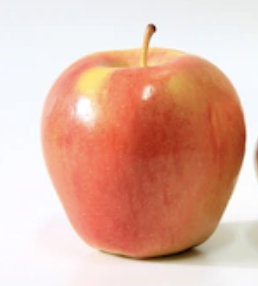
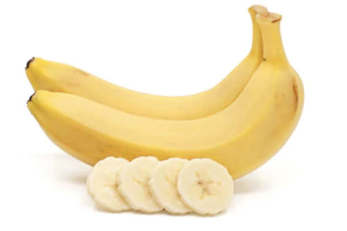
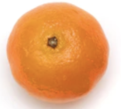
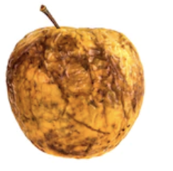
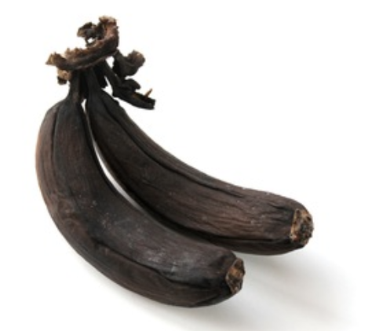
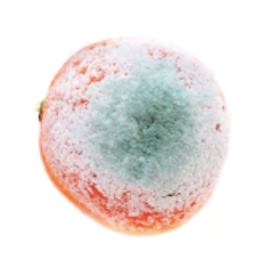

# Clasificación de Frutas con PyTorch


👨‍🎓 **Proyecto Académico**
Este proyecto fue desarrollado como parte de mi formación en aprendizaje profundo. El objetivo es demostrar la implementación práctica de técnicas de visión por computadora para clasificar imágenes.

📸 **Capturas de Pantalla**

**Frutas Frescas**





**Frutas Podridas**





## 🚀 Características

- Clasificación de imágenes en 6 categorías diferentes
- Arquitectura ResNet34 pre-entrenada
- Alta precisión (96.23% en validación)
- Compatible con Windows (optimizado para evitar problemas de multiprocessing)
- Gestión de errores robusta
- Distribución equilibrada de predicciones

## 🛠️ Tecnologías Utilizadas

- Python 3.7+
- PyTorch 1.9+
- torchvision
- pandas
- numpy
- PIL (Pillow)

## 📋 Requisitos Previos

- Python 3.7+
- pip (gestor de paquetes de Python)
- Git

## 🔧 Instalación

1. Clonar el repositorio:
```bash
git clone https://github.com/riche45/DeepLearning_pytorch
```

2. Instalar dependencias:
```bash
pip install -r requirements.txt
```

## 🌐 Uso

**Usando el script unificado (recomendado):**
```bash
# Para entrenar el modelo
python main.py train

# Para realizar predicciones con un modelo ya entrenado
python main.py predict

# Para entrenar y luego predecir de una vez
python main.py all
```

**Scripts individuales (alternativa):**
```bash
# Entrenamiento del modelo
python train.py

# Generación de predicciones
python predict.py
```

## 📊 Resultados

- **Precisión de entrenamiento**: 94.44%
- **Precisión de validación**: 96.23% 
- **Tiempo de entrenamiento**: 4.69 minutos (5 épocas)

**Distribución de predicciones:**
- rotten_apple: 101 (22.3%)
- rotten_banana: 84 (18.5%)
- fresh_apple: 75 (16.6%)
- fresh_banana: 70 (15.5%)
- fresh_orange: 65 (14.3%)
- rotten_orange: 58 (12.8%)

## 📁 Estructura del Proyecto

```
.
├── data/                  # Datos para el proyecto
│   ├── train/             # Imágenes de entrenamiento
│   ├── test/              # Imágenes de test
│   ├── train.csv          # Etiquetas de entrenamiento
│   └── sample_submission.csv  # Formato para submission
├── imagenes_muestra/      # Muestras de las clases
├── resultados/            # Resultados guardados
│   ├── mejor_modelo.pth   # Mejor modelo guardado
│   └── submission.csv     # Predicciones
├── train.py               # Script de entrenamiento
├── predict.py             # Script de predicción
├── requirements.txt       # Dependencias del proyecto
├── .gitignore             # Archivos y directorios ignorados por Git
├── LICENSE                # Licencia MIT
└── README.md              # Documentación
```

## 🔍 Clases

El modelo clasifica imágenes en 6 categorías:
- fresh_apple: Manzana fresca
- fresh_banana: Plátano fresco
- fresh_orange: Naranja fresca
- rotten_apple: Manzana podrida
- rotten_banana: Plátano podrido
- rotten_orange: Naranja podrida


   Nota sobre .gitignore:
   - El archivo .gitignore está configurado para excluir archivos innecesarios (caché, entornos virtuales, etc.)
   - Incluye una excepción para conservar los modelos entrenados en la carpeta "resultados/"
   - Puedes personalizar este archivo según tus necesidades específicas

## 🤝 Contribuciones

Las contribuciones son bienvenidas. Por favor, abre un issue primero para discutir los cambios que te gustaría hacer.

## 📝 Licencia

Este proyecto está licenciado bajo la Licencia MIT - ver el archivo LICENSE para más detalles.

## 👤 Autor

Richard Garcia - Riche45

Desarrollador en visión por computadora y aprendizaje profundo.

## 🙏 Agradecimientos

- PyTorch
- torchvision
- Python

## 📝 Notas de Actualización

- La estructura de datos actual es más simple y eficiente, manteniendo todos los archivos necesarios sin redundancias.

## ⚠️ Archivos grandes

Los archivos de modelo PyTorch (`.pth`) han sido excluidos del repositorio debido a las limitaciones de tamaño de GitHub. Puedes generarlos localmente ejecutando:

```bash
python train.py
```

O descargándolos desde el siguiente enlace: [Modelos entrenados](https://drive.google.com/drive/folders/your-folder-id)
